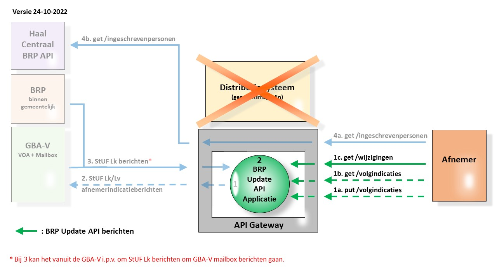

# Proces Haal Centraal BRP Update

## Introductie
Deze API is in eerste instantie ontworpen om de migratie richting een landschap van bevragen bij de bron in te zetten en versneld tot kostenbesparingen te komen.
De stap dus die leidt van het huidige landschap zoals hieronder geschetst:

  

naar een landschap waarin we de gegevensmagazijnen met BRP gegevens hebben verwijderd zoals in de volgende figuur is geschetst:

  

Echter ook nadat het bevragen bij de bron is gerealiseerd behoudt deze API zijn functie.

De scope voor het project betreft alleen de groene pijlen aan de rechterzijde van de intermediate endpoint. Voor de duidelijkheid en de broodnodige context zijn echter ook de andere interacties en systemen getekend.

Het intermediate endpoint kent de volgende functionaliteit:

* In **1** wordt de omzetting van de put en get /volgindicaties berichten (1a en 1b) naar StUF Lk/Lv berichten (2) met bestemming GBA-V afgehandeld.

* In **2** wordt het routeren van berichten, het checken van authorisaties, het bijhouden van de lijst met wijzigingen per abonnement en het bijhouden van de (duur van de) abonnementen per binnengemeentelijke afnemer afgehandeld.

### Proces

1. Voorafgaande aan het gebruik van de services in deze API abonneert een binnengemeentelijke afnemer zich bij het intermediate endpoint. Dit is een administratief proces en verloopt niet via de API.
2. Na abonneren kan een binnengemeentelijke afnemer volgindicaties instellen op de gegevens van specifieke personen door een put /volgindicaties/{burgerservicenummer} bericht (1a) te versturen. 
3. Voor het instellen van afnemerindicaties in de GBA-V worden deze berichten in **1** vertaalt naar StUF Lk berichten (2) met als afnemer het intermediate endpoint. In de binnengemeentelijke BRP hoeven geen afnemerindicaties geplaatst te worden aangezien alle daarin aangebrachte wijzigingen van belang zijn voor de intermediate endpoint. 
4. Het intermediate endpoint houdt n.a.v. de put /volgindicaties/{burgerservicenummer} berichten (1a) bij  welke afnemers in welke personen geïnteresseerd zijn.
5. Vanuit de bron (linkerzijde van de figuur) worden wijzigingsberichten (3) naar het intermediate endpoint gestuurd.
   * Als de bron de binnengemeentelijk BRP betreft dan gaat het om StUF Lk berichten. Dit zijn de berichten die voorheen naar het gegevensmagazijn werden verstuurd.   
   * Als de bron de GBA-V is dan betreft het StUF Lk berichten of GBA-V mailbox berichten. In beide gevallen worden alleen voor die personen waarop een afnemerindicatie is ingesteld berichten verstuurd.
6. Het intermediate endpoint verwerkt de berichten afkomstig van de bron naar lijsten waarin wordt bijgehouden op welk burgerservicenummer wijzigingen van toepassing zijn.
7. Een binnengemeentelijke afnemer kan nu op het moment dat hem dat schikt d.m.v. het get /wijzigingen bericht (1c) de lijst met burgerservicenummers opvragen waarop een wijziging heeft plaatgevonden en waarvan hij eerder heeft aangegeven dat hij daarin geïnteresseerd is.
8. Aan de hand van de response van dat bericht kan de afnemer vervolgens m.b.v. het get /ingeschrevenpersonen bericht (4a en onderdeel van de BRP bevragen API) de betreffende wijzigingen daadwerkelijk opvragen.
9. Het intermediate endpoint zet dat bericht vervolgens 1 op 1 door of vertaalt het naar StUF Lv of LRD+ berichten (4b). De response op deze berichten wordt wederom 1 op 1 doorgezet of vertaald en afgeleverd bij de relevante binnengemeentelijke afnemer.
10. Tenslotte kan de binnengemeentelijke afnemer nog aangeven dat hij niet meer geïnteresseerd is in een specifieke persoon of een einddatum voor de desbetreffende volgindicatie instellen. dat doet hij wederom m.b.v. het put /volgindicaties/{burgerservicenummer} bericht (1a).
    Daarbij is het handig om voor een specifiek burgerservicenummer op te vragen of er een volgindicatie is ingesteld en zo ja welke einddatum daarvoor is ingesteld. Daarvoor kan dan het get /volgindicaties/{burgerservicenummer} bericht worden gebruikt.
