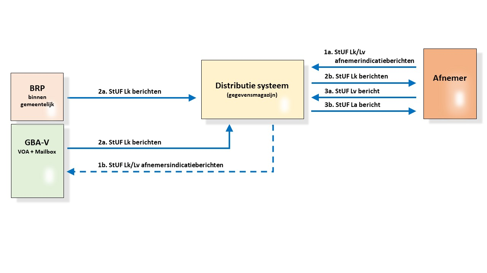

# Productvisie Haal Centraal BRP Bevragen

## Introductie
Doel van het programma Haal Centraal is om de verstrekking van basisgegevens aan binnengemeentelijke afnemers te outsourcen naar Landelijke Registraties (RvIG, Kadaster, KVK). Dit moet leiden tot een forse reductie van lokale kopieën bij gemeenten.

In principe willen we voor iedere activiteit op een lokale kopie een Haal Centraal alternatief te bieden in de vorm van een API. We beginnen bij de meest gebruikte functie die een gemeentelijk gegevensmagazijn op dit moment te bieden heeft: het zoeken en raadplegen van ingeschreven natuurlijke personen.

RvIG is nog niet betrokken bij de tot stand koming van deze API. Gemeenten kunnen de API tijdelijk implementeren, totdat outsourcing naar een Landelijke Voorziening kan worden gerealiseerd. Zo kan al een deel van de voordelen worden behaald en de migratie naar volledige outsourcing versneld.

Deze API is ontworpen om de migratie richting een landschap van bevragen bij de bron in te zetten.
De stap dus die leidt van het huidige landschap zoals hieronder geschetst:

  

naar een landschap waarin we de gegevensmagazijnen met BRP gegevens hebben verwijderd zoals in de volgende figuur is geschetst:

  

De scope voor het project betreft alleen de groene pijlen aan de rechterzijde van de intermediate endpoint. Voor de duidelijkheid en de broodnodige context zijn echter ook de andere interacties en systemen getekend.

Het intermediate endpoint kent de volgende functionaliteit:

* In **1** wordt de omzetting van de post en delete /volgindicatiepersonen berichten (1a en 1b) naar StUF Lv/Lk berichten (2) met bestemming GBA-V afgehandeld.

* In **2** wordt het routeren van berichten, het checken van authorisaties, het bijhouden van de lijst met wijzigingen per abonnement en het bijhouden van de (duur van de) abonnementen per binnengemeentelijke afnemer afgehandeld.

### Proces

1. Voorafgaande aan het gebruik van de services in deze API abonneert een binnengemeentelijke afnemer zich bij het intermediate endpoint. Dit is een administratief proces en verloopt niet via de API.
2. Na abonneren kan een binnengemeentelijke afnemer volgindicaties instellen op de gegevens van specifieke personen door een post /volgindicatiepersonen bericht (1a) met een of meer burgerservicenummers te versturen. 
3. Voor het instellen van afnemerindicaties in de GBA-V worden deze berichten in **1** vertaalt naar StUF Lk of Lv berichten (2) met als afnemer het intermediate endpoint. In de binnengemeentelijke BRP hoeven geen afnemerindicaties geplaatst te worden aangezien alle daarin aangebrachte wijzigingen van belang zijn voor de intermediate endpoint. 
4. Het intermediate endpoint houdt n.a.v. de post /volgindicatiepersonen berichten (1a) bij  welke afnemers in welke personen geïnteresseerd zijn.
5. Vanuit de bron (linkerzijde van de figuur) worden wijzigingsberichten (3) naar het intermediate endpoint gestuurd.
   * Als de bron de binnengemeentelijk BRP betreft dan gaat het om StUF Lk berichten. Dit zijn de berichten die voorheen naar het gegevensmagazijn werden verstuurd.   
   * Als de bron de GBA-V is dan betreft het StUF Lk berichten of GBA-V mailbox berichten. In beide gevallen worden alleen voor die personen waarop een afnemerindicatie is ingesteld berichten verstuurd.
6. Het intermediate endpoint verwerkt de berichten afkomstig van de bron naar lijsten waarin wordt bijgehouden op welk burgerservicenummer wijzigingen van toepassing zijn.
7. Een binnengemeentelijke afnemer kan nu op het moment dat hem dat schikt d.m.v. het get /gewijzigdepersonen bericht (1c) de lijst met burgerservicenummers opvragen waarop een wijziging heeft plaatgevonden en waarvan hij eerder heeft aangegeven dat hij daarin geïnteresseerd is.
8. Aan de hand van de response van dat bericht kan de afnemer vervolgens m.b.v. het get /ingeschrevenpersonen bericht (4a en onderdeel van de BRP bevragen API) de betreffende wijzigingen daadwerkelijk opvragen.
9. Het intermediate endpoint zet dat bericht vervolgens 1 op 1 door of vertalen naar StUF Lv of LRD+ berichten (4b). De response op deze berichten wordt wederom 1 op 1 doorgezet of vertaald en afgeleverd bij de relevante binnengemeentelijke afnemer.
10. Tenslotte kan de binnengemeentelijke afnemer nog aangeven dat hij niet meer geïnteresseerd is in een specifieke persoon. dat doet hij m.b.v. het delete /volgindicatiepersonen bericht (1b).

### Toegevoegde waarde voor gemeenten

- lagere investeringen/besparingen (geen gegevensmagazijn)
- lagere beheerkosten (geen gegevensbeheer gegevensmagazijn)

## Context

Haal Centraal is een G5 initiatief (Amsterdam, Rotterdam, Den Haag, Utrecht en Eindhoven). Het concept is getoetst in de BRK pilot van de gemeente Den Haag met het Kadaster op basis van de RSGB bevragingen standaard (voorloper BRP- en BRK-bevragen). De businesscase is gebaseerd op ervaringscijfers van de gemeente Den Haag en de softwareontwikkeling gedurende de pilot.

## Productvisie

<!--
### Business driven 
Resourcedefinitie en functionaliteit op basis van de businessvraag van de grootste gemene infobehoefte van alle binnengemeentelijke afnemers van NL. 
Niet te verwarren met modelgedreven ontwikkeling (MDD). De API is weliswaar herleidbaar naar het LO GBA 3.10, zodat de realiseerbaarheid en semantiek van de API geborgd is, maar implementation bleed en tight coupling met provider implementatiedetails wordt voorkomen.
-->
### Consumer first
Beleg de voordelen waar mogelijk bij de consumer (=binnengemeentelijke afnemer) vanwege de hefboomwerking: complexiteit bij de provider (1x), de voordelen in kosten en doorlooptijd bij de consumer (aantal binnengemeentelijke afnemers x 351)

### Developer first
Focus op bruikbaarheid voor de ontwikkelaar: AOS spec is getest op codegeneratie (Java, .NET meest gebruikt in gemeentelijke markt), ontwerpbeslissingen zijn getoetst op het effect op de code, maximale consistentie met andere Haal Centraal API’s en behaviour driven development (BDD) scenario's in Gherkin om het gedrag van de API te beschrijven.

### Contract first
…en niet development first. De API is agnostisch, vrij van implementatiedetails providersysteem en niet gevoelig voor wijzigen in systeemlogica bij de provider.

### Agnostisch
= zonder kennis van de consumer. De API moet door alle (in theorie 200 verschillende) gemeentelijke processen kunnen worden gebruikt die BRP gegevens nodig hebben.

### Geïmplementeerd 
VNG Realisatie zorgt voor een referentie-implementatie door de provider (onderdeel van definition of done). 

### Non functionals:
- supersnel
- schaalbaar
- betrouwbaar
- resilient

## Scope
Ontwerp o.b.v. een inventarisatie informatiebehoefte binnengemeentelijke afnemers van alle binnengemeentelijke afnemers van NL. Invulling van de informatiebehoefte wordt beperkt door de inhoud van het LO GBA 3.10.
-->

## REST
De API is zo RESTful mogelijk, met het oog op maximale realisatie van de REST doelstellingen: performance, schaalbaarheid, eenvoud, aanpasbaarheid, zichtbaarheid, verplaatsbaarheid en betrouwbaarheid.  

## Landelijke API Strategie voor de Nederlandse overheid
Het project conformeert zich aan de Landelijke API strategie en levert een bijdrage aan de ontwikkeling van de landelijke API strategie voor de Nederlandse overheid.  
De landelijke API_strategie heeft op het moment van ontwikkelen van de HC-aapi's nog geen formele status. De check of de HC-api's aan de landelijke API-strategie voldoen is uitgevoerd op de versie die ter vaststelling is aangeboden aan het Forum Standaardisatie op (https://docs.geostandaarden.nl/api/vv-hr-API-Strategie-20200117/ ) 

<!--
## Uitgangspunten
- Alle ingredienten van de API zijn herleidbaar naar het LO GBA 3.10
- Alle code, documenten en specificaties die ontstaan in dit traject wordt Open
Source gepubliceerd onder de
[EUPL licentie](https://joinup.ec.europa.eu/collection/eupl/eupl-text-11-12).
- Voor de specificatie van API's wordt de onlangs door Forum Standaardisatie op
de
["Pas toe of leg uit"-lijst](https://www.forumstandaardisatie.nl/lijst-open-standaarden/in_lijst/verplicht-pas-toe-leg-uit)
geplaatste
[OpenAPI Specification v3.x](https://www.forumstandaardisatie.nl/standaard/openapi-specification)
gebruikt.
- De
[API en URI strategie](https://aandeslagmetdeomgevingswet.nl/digitaal-stelsel/documenten/documenten/api-uri-strategie/)
zoals opgesteld binnen het programma Digitaal Stelsel Omgevingswet worden waar
mogelijk toegepast.
-->
## Realisatie
Van iedere informatiebehoefte van een binnengemeentelijke afnemer die bij ons bekend is wordt een issue (user story) gemaakt. Voor de meest voorkomende stories worden achtereenvolgens AOS3 specs en indien nodig BDD scenario's opgesteld en gerealiseerd. 

- OAS3 specs worden opgesteld door VNG Realisatie adviseur standaarden ism een developer. 
- OAS3 specs worden getoetst door een developer. 
- BDD scenario's worden beschreven door de PO, VNG Realisatie adviseur standaarden en de developer. 
- Refentie implementatie API wordt gerealiseerd door VNG Realisatie.

Alle deliverables worden gepubliceerd op het GitHub project. De API specificaties worden ook op SWAGGERhub geplaatst.
-->
